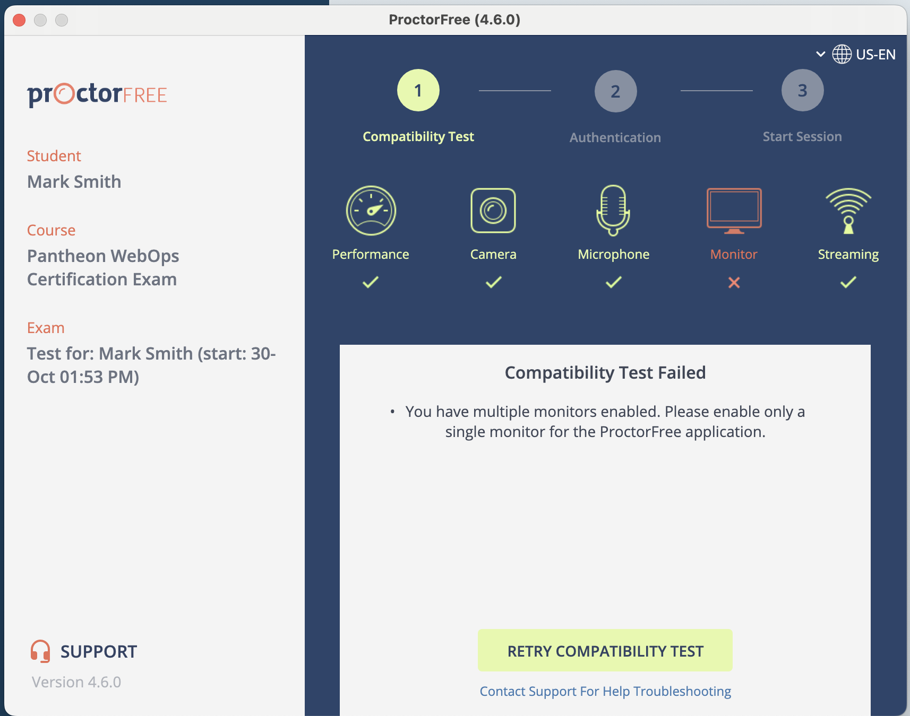
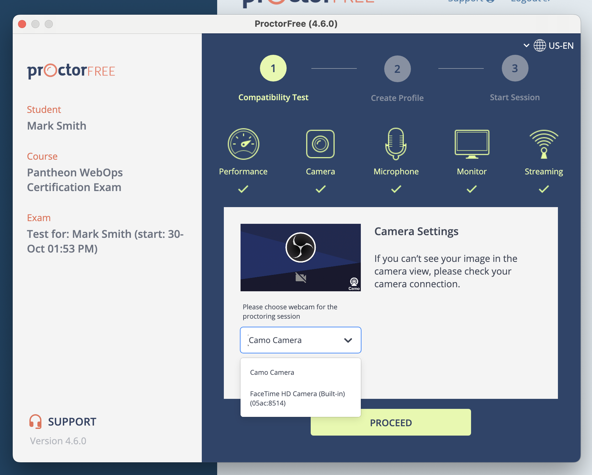

Here are some frequently asked questions about Pantheon's WebOps Certification Program.

<Accordion title="Where Can I Find Materials to Study for the Pantheon WebOps Certification Exam?" id="study-guide" icon="wrench">

In addition to [this guide within our documentation](/certification/study-guide) you can download a [PDF version that contains hands-on activities and review questions.](https://certification.pantheon.io/sites/default/files/2023-11/webopscert_final_v1_1.pdf).

</Accordion>

<Accordion title="What are the directions for launching my exam?" id="directions" icon="wrench">

You can find the directions for launching the exam here: [Exam Instructions](/certification/exam-instructions)

</Accordion>

<Accordion title="How do I use the ProctorFree virtual proctoring service for my exam?" id="ProctorFree" icon="wrench">

Pantheon’s Certification Program utilizes [ProctorFree](https://www.proctorfree.com/), a software-only identity verification and exam recording solution. The following document describes the requirements for successfully enabling ProctorFree when taking a Pantheon Certification exam.

Before you get started, please note the following:

1. **You must unplug your machine from any external monitors.**

ProctorFree checks for external monitors that are connected to the test taker’s laptop. This is to ensure that the test taker does not have access to answers or prohibited information while they are taking the test.

The use of an external monitor will result in a system check failure:

An external monitor will also result in a failed exam result, as Pantheon does not permit the use of external information sources during the exam.

2. **Your web camera and microphone must be enabled.**

ProctorFree captures your exam session using a web camera, microphone, and screen capture. The proctoring software must have permission to access each of these three features. If any of these features are not accessible to ProctorFree, you will get a prompt instructing you on how to grant the proctoring service access to each feature.

During the **microphone test**, you may be required to speak for a few seconds to allow the microphone to pick up the sound and confirm that it is working.

To select a **web camera**, locate the dropdown menu (shown below) and select your camera of choice:

3. **Your machine must be running either Windows 10+ or macOS 10.12+ (Sierra).**

If you are using a Linux machine, you will need to indicate this on the form when you sign up for the exam. In this case, or in any case where the local machine is incompatible with ProctorFree, we are able to accommodate the exam attempt in alternative ways. Typically, we will schedule a Zoom meeting for your exam session, with a live proctor from Pantheon validating the exam attempt by having you turn your web camera on and share your screen while you take the exam.

4. **Tablets, Chromebooks, iPads, and mobile devices are not supported.**

Remote exam sessions must be completed on a laptop or desktop computer that meets the minimum technical requirements.

</Accordion>

<Accordion title="Do I need a camera?" id="camera" icon="wrench">
In order to take the exam with our automated proctoring service, you will need a working web camera to record your test taking session. Please reach out to us if you have any questions about this.
</Accordion>

<Accordion title="What are the technical requirements for taking a Pantheon Certification?" id="technical-requirements" icon="wrench">

In order to maintain compatibility with our online proctoring service, we require that exam takers use machines that adhere to the following minimum technical specifications:

**Computer:** We support most standard laptops and desktops that include the minimum hardware requirements listed below. Chromebooks, Linux, iPads, tablets, and mobile devices are not supported.

**Operating System:** We support environments that use Windows 10 or greater, or macOS 10.12 (Sierra) or greater. Unfortunately, our online proctoring service does not support the use of Linux machines. If you are using a Linux machine, we are happy to accommodate by setting up a live proctored test that does not use the automated proctoring service. Windows S mode is not supported.

**Hardware Requirements:** The following are required: at least 1 GB available disk space, minimum 2GB RAM, and Intel Quad-core 1.8GHz CPU (or better) or AMD Quad-core 2.0 GHz CPU (or better).

**Web Browser:** We Support Chrome, Firefox, Safari, Microsoft Edge, and Internet Explorer 11+. Brave and Opera are not supported at this time, nor is Microsoft Edge for macOS.

**Internet Speed:** Minimum upload speed of 1 Mbps, and a minimum download speed of 2 Mbps. Tethering and hotspots are not supported. (An active broadband internet connection is assumed since the examinations are done online).

**Web Camera & Microphone:** An external or internal web camera and microphone are required. Camera and microphone drivers must have been updated or released within the last 5 years. 3D Webcams are not supported at this time.

</Accordion>

<Accordion title="How do I register for an exam?" id="register" icon="wrench">

You can register for the [Pantheon WebOps Certification Exam with the form on this page](https://pantheon.io/certification). On the homepage of the site, there is a form for you to fill out. It will ask for your name, email address, organization (if applicable), and some technical information about the computer you will be using to take the exam. This is to help us ensure that your computer is technically compatible with our exam engine and proctoring service. You will then choose a date to take the exam. Once you submit this form, you will be redirected to a payment processor to complete your payment and secure your spot in our certification program.

</Accordion>

<Accordion title="How do I get certificate and a badge?" id="badge" icon="wrench">

When you have finished taking the exam, you will see a message on the screen indicating whether you have passed or not. Once you have passed the exam, we will go through the process of validating the results. This validation can take up to 48 hours, at which point you will receive an email with a link to your badge and certification. We will also display your name, certification date, and a link to your badge and digital certificate on our Certification Registry site.

</Accordion>
