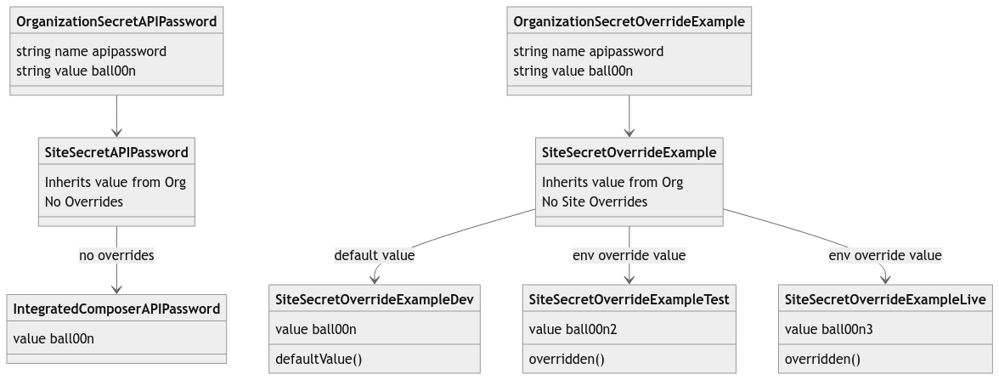

<dl>

<dt>Secret</dt>

<dd>

A key-value pair that should not be exposed to the general public, typically something like a password, API key, or other sensitive information that should not be added to version control.

</dd>

<dt>Secret type 1</dt>

<dd>
This is a field on the secret record. It defines the usage for this secret and how it is consumed. Current types are:

  * `runtime`: this secret will be used to retrieve it in application runtime using API calls to the secret service. This is the recommended type to set if you want your secret to be exposed to the application runtime.

  * `env`: this secret will be used to set environment variables in the application runtime. This type is currently only supported for Integrated Composer builds and the use case of an environment variable in the application runtime is not supported.

  * `composer`: this secret type is used for composer authentication to private packages and it is the recommended method for doing so.

</dd>

<dt>Secret Scope</dt>

<dd>
A secret's scope is the answer to the question "Where is the secret's value available?". Once, set a secret's scope cannot be changed. The secret must be deleted and recreated.

  * `ic`: This secret will be readable by the Integrated Composer runtime. You should use this scope to get access to your private repositories.

  * `web`: this secret will be readable by the application runtime.

  * `user`: this secret will be readable by the user. This scope should be set if you need to retrieve the secret value at a later stage.

</dd>

<dt>Owning Entity</dt>

<dd>

* **Organization-owned secrets** -  Organization-owned secrets are available to every site and environment that are associated with the owning organization. A common use-cases is for a CI system and infrastructure that's shared among all sites in an organization. Note that secrets from "Supporting" Organizations are explicitly ***not shared*** with the sites they support. Sites receive secret key/value pairs from their Primary Organization only.

* **Site-owned secrets** -  Site-owned secrets are available to the site and all of its environments. A common use-case is Github tokens that a site's composer build can use to access private repos referenced in the composer file.

* **Environment override**  - Environment overrides provide overrides to a secret value for a specific environment. A common use case for this are API keys that are different in production and non-production environments.

</dd>

<dt>Value Resolution</dt>

<dd>

1. Organization values are resolved first. They form the base value for the key-pair's value resolution.

3. Site values are resolved second and secret values set on the site level will override secret values set for the organization. To return the secret to it's organization value, simply delete the site value.

4. Environmental overrides are resolved finally and if the override exists, it will become the value provided to the calling function.

5. Each secret's value can be no larger than 16k (16384 Bytes)

</dd>

</dl>

**Notes**
1: Note that you can only set one type per secret and this cannot be changed later (unless you delete and recreate the secret).
