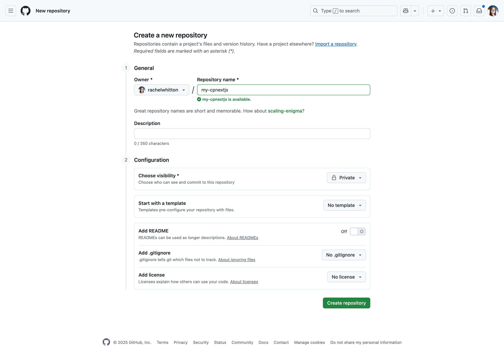
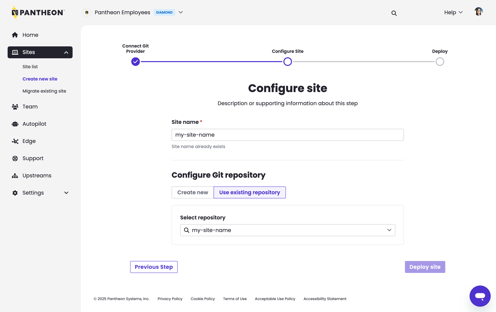
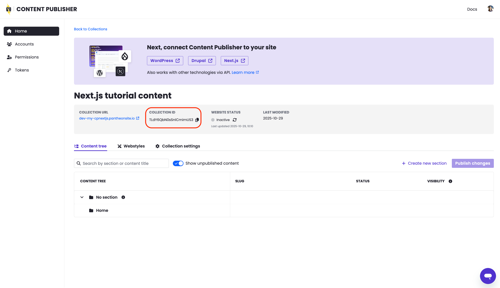
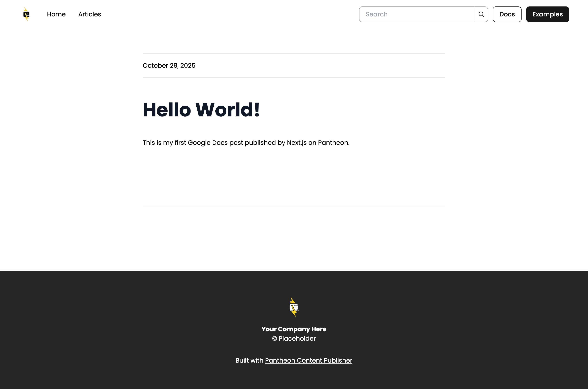

<Partial file="nextjs-pre-ga.md" />

Pantheon's Content Publisher shines as a way to send content straight from Google Docs to a Next.js site hosted on Pantheon.
This tutorial will walk you through the steps needed to make a simple site combining the two.

## Learning Objectives

This tutorial will walk you through:

* Making a new Next.js codebase using the [Next.js Content Publisher Starter](https://github.com/pantheon-systems/content-publisher-sdk/tree/main/starters/nextjs-starter-approuter-ts).
* Creating a new GitHub repository to hold that codebase.
* Creating a new Pantheon site that will build and run the code from that repository.
* Creating a Content Publisher collection that will send content to the Next.js site.
* Configuring environment variables on Pantheon to connect the Next.js site to the Content Publisher collection.

## Requirements

* Access granted for the [Next.js Private Alpha Program](/nextjs/#access--availability)
* A GitHub account with [SSH configured](https://docs.github.com/en/authentication/connecting-to-github-with-ssh/about-ssh)
* A [Content Publisher account](https://docs.content.pantheon.io/#h.9owhdt6w06gr) with [Administrator access](https://docs.content.pantheon.io/roles)
* Install the following applications:
  - [Git](https://git-scm.com/)
  - [Terminus](/terminus/install)*
  - [Terminus Secrets Manager Plugin](https://github.com/pantheon-systems/terminus-secrets-manager-plugin)
  - Content Publisher requirements:
    - [Node.js and npm](https://docs.content.pantheon.io/cli-setup#h.tqdsaj5gmjzp)
    - [Content Publisher CLI](https://docs.content.pantheon.io/cli-setup#h.6sxx14u8zeur)*
    - [Content Publisher Google Docs add-on ](https://docs.content.pantheon.io/add-on-install#h.32fczwiey3t0)
  - Optional:
    - [Terminus Node Logs Plugin](https://github.com/pantheon-systems/terminus-node-logs-plugin)

\* Requires logging in after installation.

## Create a local Next.js codebase

With all the requirements above in place, we will now make a local codebase for our Next.js site.

Run this command (replacing `my-site-name` with a unique name for your site):

```bash{promptUser: user}
 pcc init my-site-name --eslint --ts --appRouter
```

You can answer the interactive prompts that follow with "no" since we have not yet made a Content Publisher collection or token to go with this site.

When the command completes, you will have a simple Next.js codebase on your local machine in a directory named `my-site-name`.

### Create a GitHub repository

Next, we will create a new repository on GitHub to hold the codebase we just made.

You can do this via GitHub's web interface or via the command line.



Leave the repository empty for now and do not add a README, .gitignore, or license.

Since this repository is meant to be a tutorial, you may want to make it private.

### Push the codebase to GitHub

Now, we will push the codebase we made with `pcc init` to the new repository on GitHub.

1. First, change into the directory holding the codebase:

  ```bash{promptUser: user}
  cd my-site-name
  ```
1. Next, initialize a new Git repository:

  ```bash{promptUser: user}
  git init
  ```
1. Next, add the files in the directory to the new Git repository:

  ```bash{promptUser: user}
  git add .
  ```
1. Next, commit the files to the new Git repository:

  ```bash{promptUser: user}
  git commit -m "Initial commit"
  ```
1. Finally, add the GitHub repository as a remote and push the code to it (replacing `myname` and `my-site-name` with your GitHub username or organization and the name of the repository you created):

  ```bash{promptUser: user}
  git remote add origin git@github.com:myname/my-site-name.git
  git push -u origin main
  ```

## Create a new Pantheon site

With a GitHub repository holding our Next.js codebase, we can now create a new Pantheon site and use [Pantheon's GitHub Application](https://docs.pantheon.io/github-application) to trigger builds in response to code changes.

1. [Go to the workspace](/guides/account-mgmt/workspace-sites-teams/workspaces#switch-between-workspaces) and click the **Create New Site** button. Then click **Next.js**.
1. Click **Connect** next to GitHub. You will be prompted to install and authorize the [Pantheon Site Integration](https://github.com/apps/pantheon-site-integration) GitHub application.
1. Select the newly authorized account, then click **Continue**.
1. In the **Configure Site** step, switch tabs to **Use existing repository**, then enter a **Site name** and select your existing repository from the dropdown menu. Click **Deploy site**:

  

1. Click **Begin Deployment**. Do not close the tab or navigate away from this page until the workflow is complete.

The build process will return an error because we have not yet configured the environment variables needed to connect to Content Publisher.

(Optional) You can see this progression of build statuses using Terminus:

```bash{promptUser: user}
terminus node:logs:build:list my-site.dev
```

To make the build and deployment succeed, will will need a Content Publisher collection and token.

## Create a Content Publisher collection

Now let's make a Content Publisher collection that will send content to our new Next.js site.

You _can_ reuse an existing Content Publisher collection if you have one, but for this tutorial we will make a new one.

1. Go to the [Content Publisher dashboard](https://content.pantheon.io) and log in.

1. Next create a new collection by clicking the **"New collection"** button.

1. Enter something simple for **Collection name** like "Next.js tutorial content".

1. For the **URL** field, enter the URL of your new Pantheon site's Dev environment, like `https://dev-my-site-name.pantheonsite.io/articles`.

  <Alert title="Tutorial vs. production usage" type="info" >

  When using this combination of Content Publisher and Next.js in production, you would likely use the URL of your live environment here. For more information on deploying to Test and Live environments, see [Deploying to Test and Live](/docs/nextjs/test-and-live-env).

  </Alert>

1. Set [Collection access](https://docs.content.pantheon.io/publishing-permissions#h.q3xmgo7a5kws). Since this collection is meant to be a tutorial, you may want to select **Only managers and authorized users**.

1. Click **Create collection**.

## Connect Content Publisher to your site

Now that we have a Content Publisher collection, we can configure the environment variables needed to connect our Next.js site to that collection.

1. From the **Tokens** tab of the [Content Publisher dashboard](https://content.pantheon.io/dashboard/settings/tokens) click **Create access token** and fill in the prompt. The token will only be shown once, copy it to your clipboard now for use in the following step.

1. Set `PCC_TOKEN` as an environment variable on Pantheon using [Terminus Secrets](/guides/secrets). Replace `my-site-name` and `your-token-here`:

  ```bash{promptUser: user}
  terminus secret:site:set my-site-name  PCC_TOKEN your-token-here --type=env --scope=web,ic --no-interaction
  ```

1. From the **Home** tab of the [Content Publisher dashboard](https://content.pantheon.io/dashboard/collections) find and select your new collection. Copy the collection ID. For example:

  

1. Set `PCC_SITE_ID` as an environment variable on Pantheon using [Terminus Secrets](/guides/secrets). Replace `my-site-name` and `your-collection-id-here`:

  ```bash{promptUser: user}
  terminus secret:site:set my-site-name  PCC_SITE_ID your-collection-id-here --type=env --scope=web,ic --no-interaction
  ```

### Trigger another build

To see the changes take effect make another commit to the GitHub repository to trigger a new build and deployment. For example, you can add a new line to the README file in the main branch to trigger a build on Dev.

#### (Optional) Review Build Status from the CLI
To view the status of that process, run this command, replacing `<site>` with your sitename:

```bash{promptUser: user}
terminus node:logs:build:list <site>
```

## Publish from Google Docs to your Next.js site 

1. [Create a new Google Doc](https://docs.new/) and [connect it to your collection](https://docs.content.pantheon.io/add-on-install#h.25elm2hpgwjj) using the Google Docs add-on.
1. [Publish your new page using the add-on](https://docs.content.pantheon.io/preview-publish#h.7ovppm53h4ec).
1. Click **View live content** and you should see your new page, for example: 
  