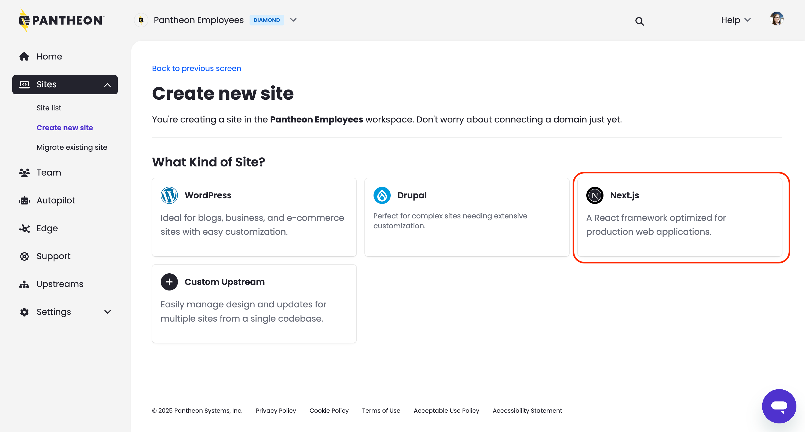
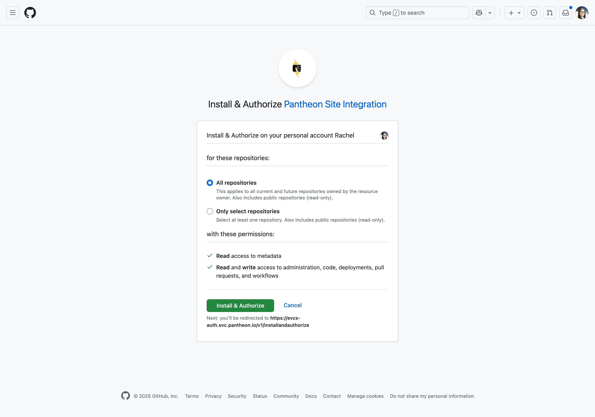
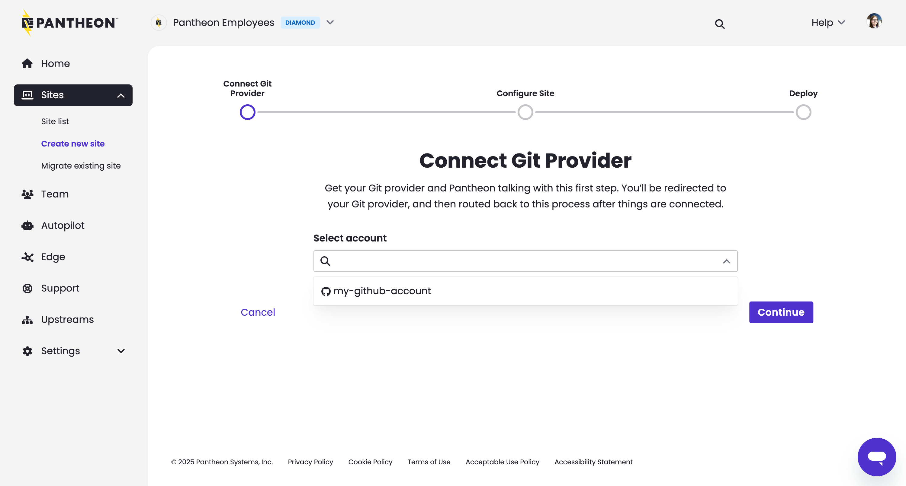
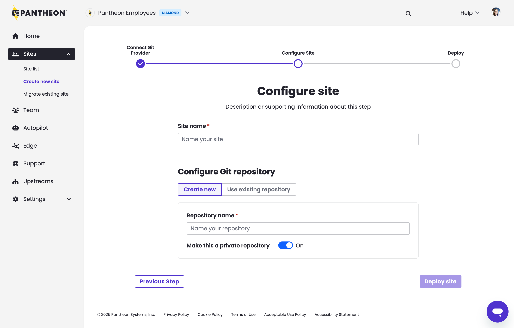
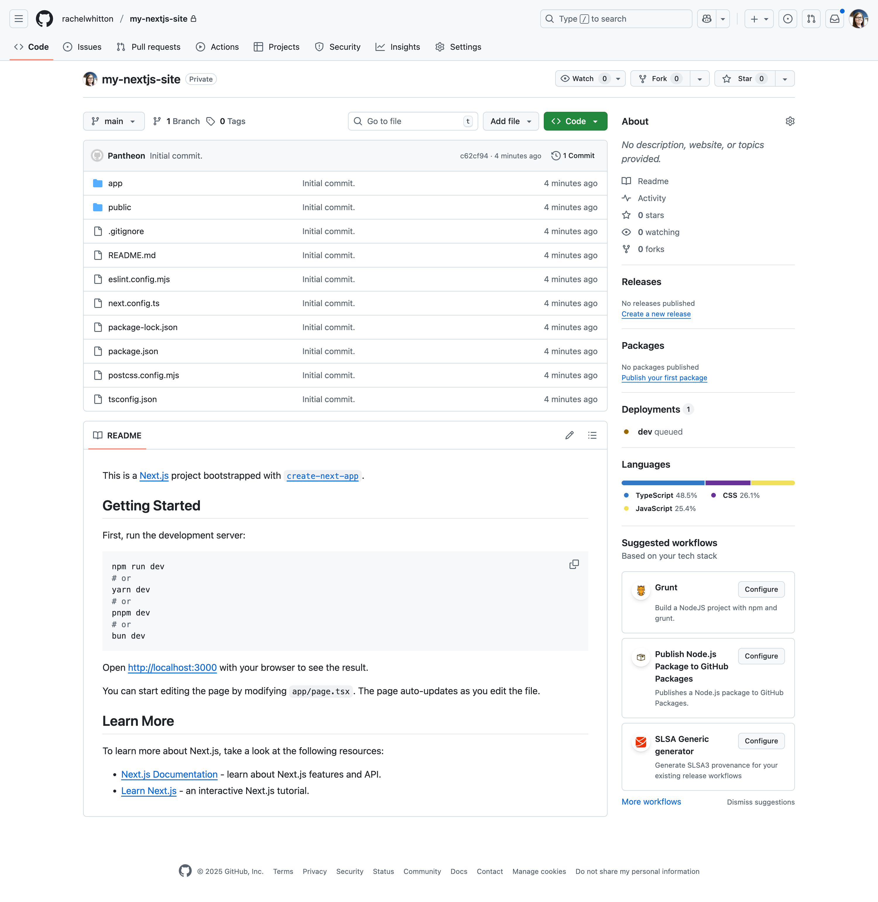
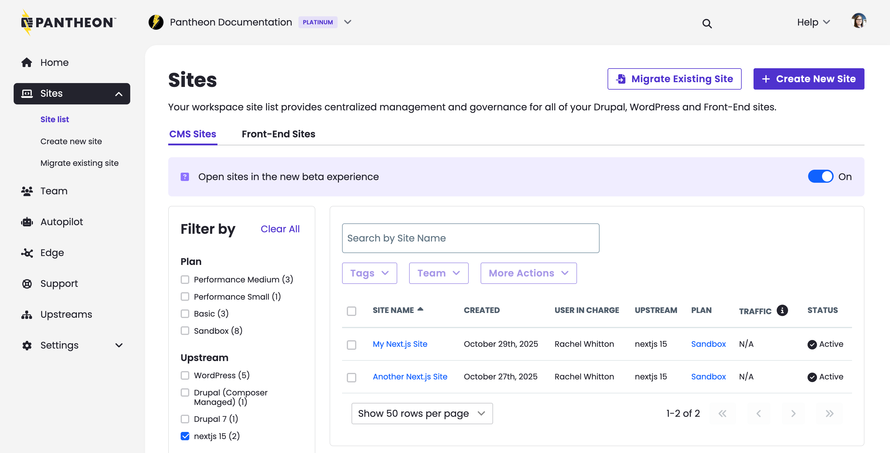
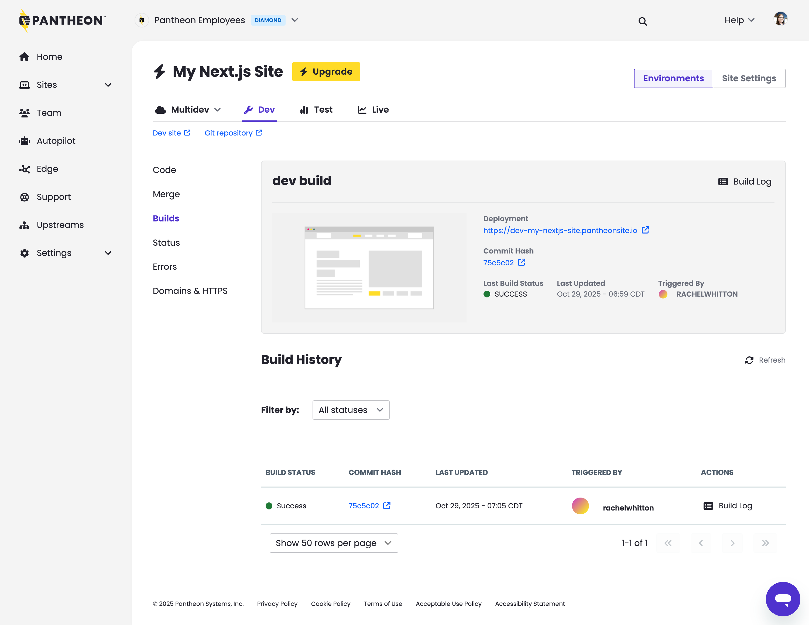
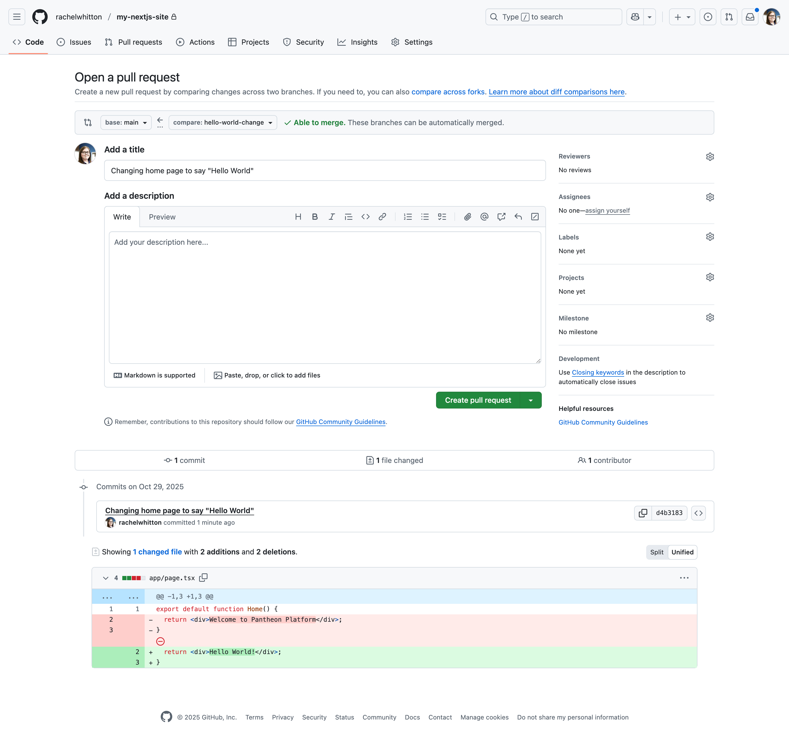
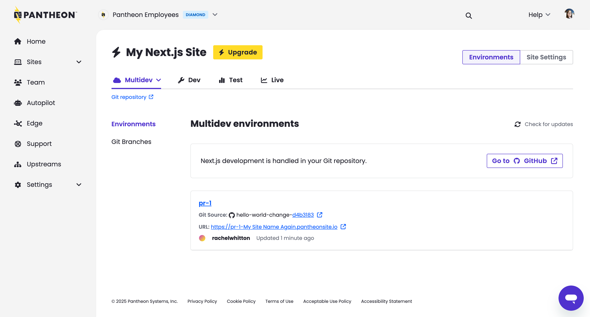

<Partial file="nextjs-pre-ga.md" />

## Learning Objectives 

This tutorial will walk you through: 

* Creating a Next.js site via the Pantheon Workspace Dashboard, with a corresponding GitHub repository.
* Making a minor code change using the pull request workflow in GitHub and creating a new Multidev environment in the Pantheon Site Dashboard.
* Accepting that change by merging the pull request and subsequently deploying to the Dev environment.

## Requirements 

* Access granted for the [Next.js Private Alpha Program](/nextjs/#access--availability)
* A GitHub account with [SSH configured](https://docs.github.com/en/authentication/connecting-to-github-with-ssh/about-ssh)
* Install [Git](https://git-scm.com/)
* (Optional) Install the following applications:
  - [Terminus](/terminus/install)*
  - [Terminus Node Logs Plugin](https://github.com/pantheon-systems/terminus-node-logs-plugin)

\* Requires logging in after installation.

## Site creation

1. [Go to the workspace](/guides/account-mgmt/workspace-sites-teams/workspaces#switch-between-workspaces) and click the **Create New Site** button. Then click **Next.js**:

  

1. Click **Connect** next to GitHub. You will be prompted to install and authorize the [Pantheon Site Integration](https://github.com/apps/pantheon-site-integration) GitHub application: 

  

  <Alert type="info" title="Note">

    If you prefer not to grant permissions for all repositories as demonstrated above, you can instead create an empty repository now in GitHub. Once created, return to this step and choose **Only select repositories** then select your new repository.

  </Alert>

1. Select the newly authorized account, then click **Continue**: 

  

1. Enter a unique sitename and unique repository name then click **Deploy**:

  

1. Click **Begin Deployment**. Do not close the tab or navigate away from this page until the workflow is complete. 

### Site creation results

This site creation process will take a few minutes to complete. Once it completes you will see:

* A repository in your GitHub account with the name you specified. It will contain a copy of [the sample Next.js codebase](https://github.com/pantheon-upstreams/nextjs):

  

* You will see your newly created site listed in the Workspace:

  

* Within that site, you will be able to click on the "Dev site" link and see the minimal site:

  

## Pull Request Workflow

In this section we will make a change to Next.js code and then see that change in a non-live Pantheon environment specific to the pull request.

### Making a code change

[Clone](https://docs.github.com/en/repositories/creating-and-managing-repositories/cloning-a-repository) your new Next.js codebase to your local workstation and using your preferred code editor, make a small change to `app/page.tsx`.

For instance you can change the text "Welcome to Pantheon Platform" to "Hello World!"

Now make a separate Git branch, commit, and push to GitHub. On the command line, those commands are:

```bash{promptUser: user}
git checkout -b hello-world-change
```

Verify that the differences you are about to commit are what you expect:

```bash{promptUser: user}
git diff
```

This command will show you the alteration you made to `app/page.tsx`.

Next, commit this change:

```bash{promptUser: user}
git commit -am 'Changing home page to say "Hello World"'
```

Push your new branch to GitHub before making a Pull Request.

```bash{promptUser: user}
git push origin hello-world-change
```

### Automatically Deploy to Multidev

With a new branch pushed to GitHub, open a pull request against the main branch in GitHub:



The creation of the Pull Request will prompt Pantheon to start a build and deployment process.

### (Optional) Review Build Status from the CLI
To view the status of that process, run this command, replacing `<site>` with your sitename (which presumes we are listing the logs that correspond to the first Pull Request, or `pr-1`):

```bash{promptUser: user}
terminus node:logs:build:list <site>.pr-1
```

Over the course of a few minutes, you will see the statuses update as the files necessary to run Next.js are built and deployed.
See this [section for more details on the build and deployment process](/nextjs/architecture#build-and-deploy-process).

For as small of a change as we made in this pull request, some "Hello World" text, we should soon see DEPLOYMENT_SUCCESS as the status.
Once that status is reached, you should be able to see your change in your browser by opening a Multidev environment from your dashboard.



Having seen this change to the Next.js site deployed on a non-live environment we can merge it with more confidence.

If you chose to merge this change you can watch the same progression of build and deployment statuses through `terminus node:logs:build:list my-site-machine-name.dev`.

### Conclusion

Having reached a "Hello World" state with Next.js on Pantheon, you might want to proceed to one or more other Tutorials or guides.

* [How-To Guide: Migrating from Front-End Sites walk through moving a site away from Pantheon's prior offering for hosting Next.js](/nextjs/migrating-from-front-end-sites).
* [Learn to Troubleshoot errors and set environment variables](/nextjs/logs-and-environment-variables-tutorial).
* [Deploy to Test and Live environments and connect a custom domain name](/nextjs/test-and-live-env).
* [Connect Next.js to Content Publisher](/nextjs/content-publisher-tutorial).
